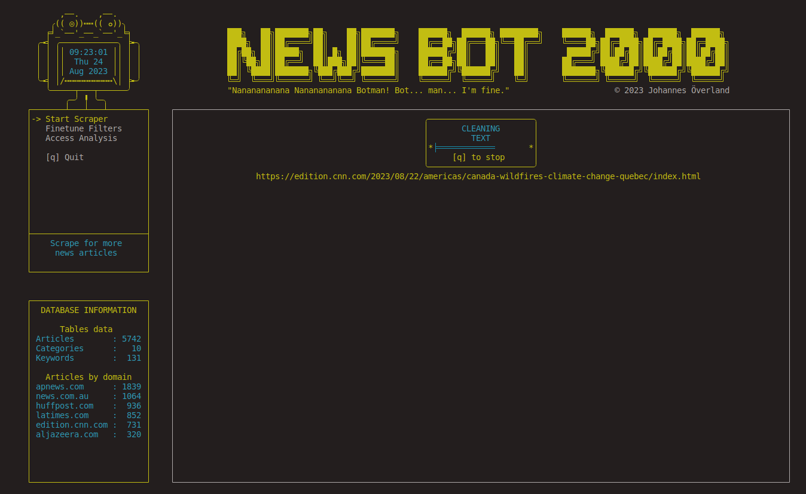
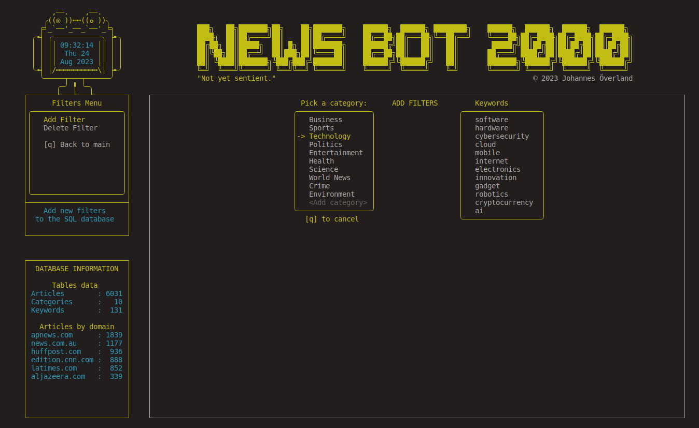
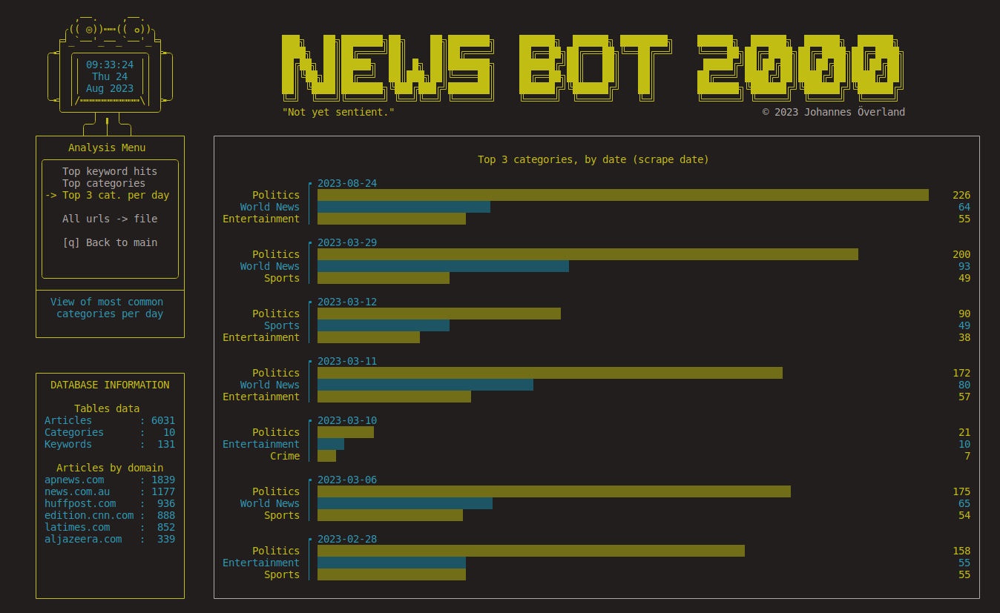
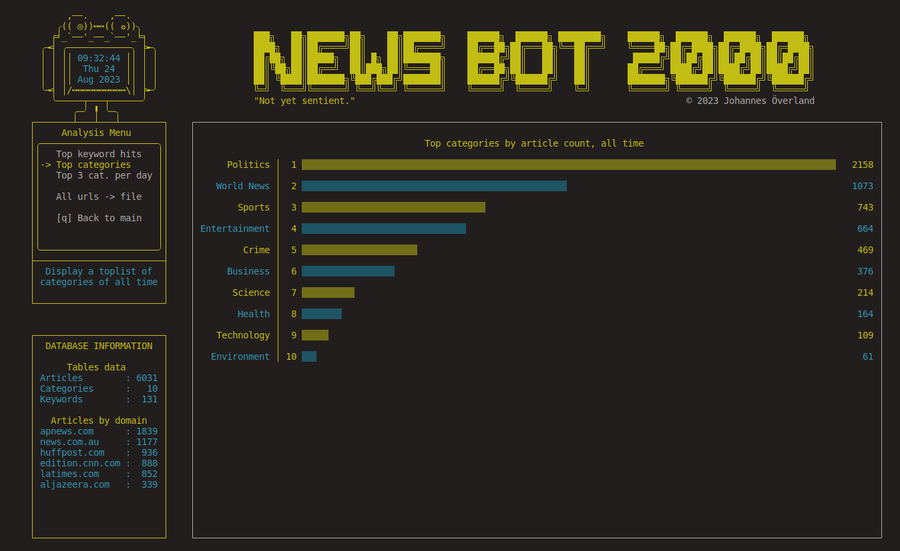
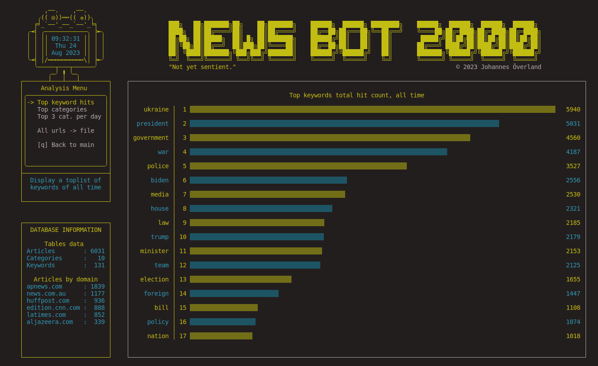

# NewsBot2000: A Dynamic News Data Cruncher

NewsBot2000 is a robust and interactive tool built using the `curses` library. It enables real-time analysis of news data, allowing users to add categories and filters on the fly. Analyze historical news data with ease and visualize the results through intuitive graphs.

## Installation

### Prerequisites
- Python (compatible version)
- A full-sized terminal window

### Instructions
1. Clone the repository and navigate to the project directory.  
2. Install the required packages listed in `requirements.txt` using your preferred environment or virtual environment.  
**Note:** On Windows systems, you will also need to run:
```bash
pip install windows-curses
```

(Linux and macOS systems generally include curses by default.)

## Running the Application  
Execute `main.py` in a `full-size` terminal window for the application to function correctly.  

## Usage
NewsBot2000 allows you to:  

- Add Categories & Filters: Modify your data view on the fly, reflecting your choices in the graphs.
- Analyze Historical News Data: Apply new filters to analyze past news data, providing valuable insights.
## Technologies & Libraries Used
- Curses: For building the interactive terminal interface.
- Beautifulsoup: For sifting through web data.
- Regex: For pattern matching within the data.
- Pandas: For efficient data manipulation.
- SQL: For database management.  
- and several more, listed in `requirements.txt`.

Enjoy exploring news data with NewsBot2000!

## Screenshots  

### Scraper at work  


### Edit categories and keywords  


### Graphs  
  

  
  
  